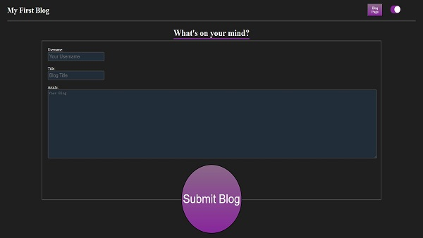
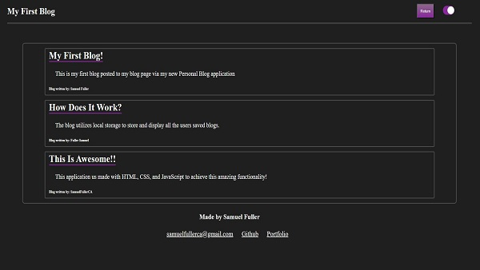
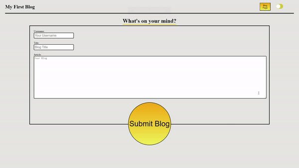

# Personal-Blog

## Description

An application that utalises local storage to display a users blogs, written in the 'Personal Blog' page, onto the 'Blog Posts' page. Any blog written an added will generate in the list of blog posts and be present when page is closed, revisited, or refreshed. Aditionally provided is a dark-mode and light-mode switch that also keeps its value when page is closed, revisited, or refreshed. This application utalises HTML CSS and JavaScript to achieve its desired function and can act as a users personal journal, or even a noteboard.

## Usage

Blogs are filled out on the 'Whats on your mind?' form and once submitted the user is redirected to the 'Blog Posts' page where their newly written blog and all of the users previous blogs are present. The user can return to the previous page to write a new blog via the 'Retun' button and go back to the 'Blog Posts' page via the 'Blog Page' button. Upon first page load the user can opt to tggle on dark-mode via the upper right switch. Whichever mode the user prefers, light or dark, will be present on both pages regardelss of what page they toggle the slider on. Finally blogs can be clearn by deleting the blogs key in local storage. This can be achieved by right-clicking the page, selecting inspect, navigating to the Application tab(This tab may be hidden under the >> 'more tabs' button), and selecting Local Storage int he console left drop-down menue

  

## Features

Notable features, outside the usage of local storage and the dark-mode toggle, include the alert system that won't let a blog post be submitted if any of the form is left blank. Alerts wll appear telling the user which entry specifically has been left blank and needs to be fixed. Aditionally if it is the users first time loading the application, they cannot access the Blog Posts Page via the 'Blog Page' button without first submitting at least 1 blog.

## Credits

functionality gif made with ezgif.com
